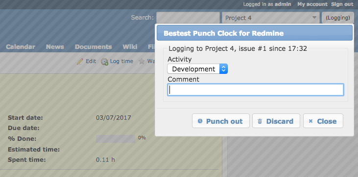

# Bestest Punch Clock for Redmine

This is a really simple timer/punch clock plugin for Redmine, inspired by the Firefox Add-on [Redmine Timer](https://addons.mozilla.org/en-US/firefox/addon/redmine-timer/).

It adds a single button to Redmine that starts logging time to the current issue or project. Click it again to select activity, add a comment, commit or abort.

And that's all there is to it.



# Installation

`cd` into the `redmine/plugins` folder and run:
```bash
  git clone https://github.com/LeviticusMB/bestest_timer.git
```

# Upgrade to latest stable release

`cd` into the `redmine/plugins` folder and run:
```bash
  git pull
```
